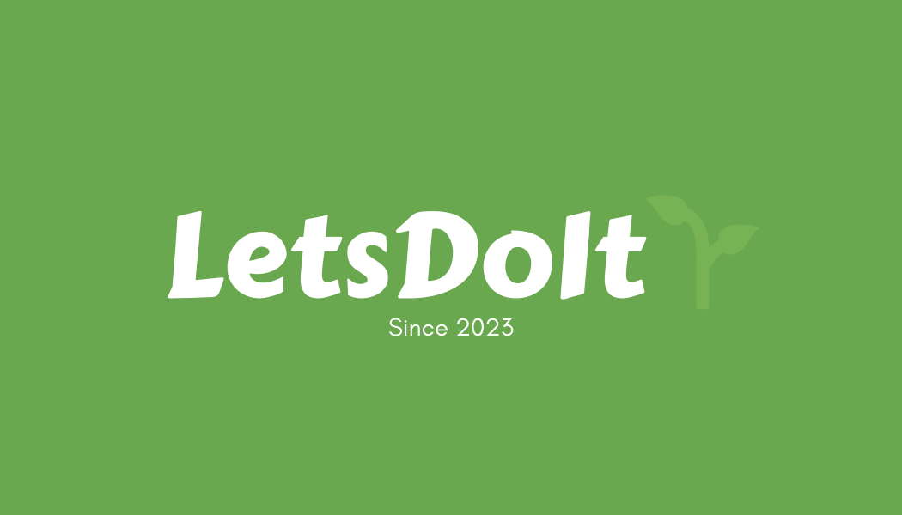

<div align="center">

# 💻 Dive into the Digital Depths with John! 💻

[](mailto:jcsandoval978@gmail.com)
[](https://www.linkedin.com/in/1john-sandoval/)
[](https://github.com/jsandoval1)
[-0A0A0A?style=for-the-badge&logo=dev.to&logoColor=white>)](#)

</div>

```javascript
// Welcome to my profile! Here's a random greeting function to get you started.
const greetings = ["Hello!", "Hey!", "Welcome!"];
console.log(greetings[Math.floor(Math.random() * greetings.length)]);
```

### 🚀 Languages I use 🚀


### 🛠️ Frameworks I use 🛠️


### 🧰 Tools I use 🧰


### 🗄️ Databases I use 🗄️


</div>

---

<div align="center">
<br/>

### About Me

👨‍💻 As a software engineer with a background in logistics management, I bring a unique perspective to the tech industry. My passion for improving systems, safety, and productivity drives my exploration of new technologies and programming languages. 🚀

🔭 My journey in software engineering has been fueled by my curiosity and my desire to leverage technology to solve complex problems. I've worked on a variety of projects, each offering unique challenges and opportunities for learning. 🧠

🌱 I'm always ready for new challenges and eager to contribute to meaningful projects. Let's connect if you're interested in collaboration or discussing tech! 🤝

</div>

---

<div align="center">
<br/>

### 🧪 Experiments from My Coding Lab 🧪



A social platform for task management, built with Spring Boot and AWS RDS (MySql), and deployed on AWS.

You can [visit the live site](http://letsdoit-app.com/) or [view the repository on GitHub](https://github.com/jsandoval1/LetsDoItApp) for more details.

---


A movie and TV show database, built with the MERN stack and deployed on AWS.

You can [visit the live site](http://nightflix-app.com/) or [view the repository on GitHub](https://github.com/jsandoval1/Nightflix) for more details.

---

**🔜 More projects are coming soon. Please check back later! 🔜**

<div style="display: flex; justify-content: center;">
    
</div>

<br/>
</div>

---

<div align="center">
<br/>

### 📊 My Coding Journey by the Numbers 📊

#### Languages in My Toolbox

<div style="display: flex; align-items: center;">
    <h4 style="margin-right: 10px;">Java</h4>
    
    
</div>
I have used Java extensively in my backend development work, particularly with Spring Boot.

<div style="display: flex; align-items: center;">
    <h4 style="margin-right: 10px;">JavaScript</h4>
    
    
    
</div>
I have experience in both frontend and backend development using JavaScript, including Node.js and React.

<div style="display: flex; align-items: center;">
    <h4 style="margin-right: 10px;">Python</h4>
    
    
</div>
I have used Python for scripting, data analysis, and web development with Django and Flask.

##### About My GitHub Stats

Even though I am still young in my development journey, I have found a passion and joy in coding. I code at least 4 days a week, finding it not just a task, but an exciting adventure. I plan on continuing to grow my skills and knowledge in my free time. I am eager to break into the tech world and contribute my enthusiasm and dedication to this field.

<div style="display: flex; flex-wrap: wrap; justify-content: space-around; align-items: center;">
    
    
</div>

**🔥 Check out my pinned repositories below! 🔥** They showcase my most recent work and the projects I'm most proud of. **Dive in, explore, and don't hesitate to share your thoughts!**

</div>

<!-- *Alternate gifs to swap out when wanted -->
<!--
Cartoon hacker:


Monkey typing:


Octocat bubbly:


Blue/gray man coding:


Loading 3D cube (white):


Eat, sleep, code, repeat:
 -->

<!-- * Alternative stats -->
<!-- <td style="text-align: center; vertical-align: middle;">

</td> -->